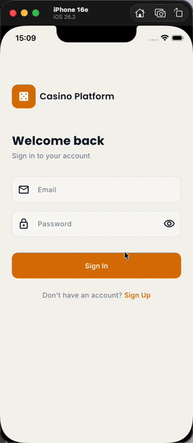

# Flutter Casino Platform

[](https://github.com/kovalenko-tech/flutter-casino-platform/actions/workflows/ci.yml)

A local-first Flutter casino platform showcasing clean architecture, a custom design system ("Velvet & Gold"), and BLoC-based state management — with zero external back-end dependencies.

---

## Demo

<p align="center">
  
</p>

---

## Table of Contents

- [Demo](#demo)
- [Overview](#overview)
- [Architecture](#architecture)
- [Folder Structure](#folder-structure)
- [Design System — Velvet & Gold](#design-system--velvet--gold)
- [Localization](#localization)
- [Mock Repository Strategy](#mock-repository-strategy)
- [Testing](#testing)
- [Packages](#packages)
- [Getting Started](#getting-started)
- [Key Decisions](#key-decisions)

---

## Overview

| Feature | Description |
|---------|-------------|
| **Auth** | Local registration + login + change password, SHA-256 hashing with random salt, stored in SQLite |
| **Home** | Hero banner carousel (auto-scroll), category filter chips, 4-column game grid, notification bell |
| **Games** | Full game catalogue with search, detail screen with RTP / volatility indicators |
| **Profile** | User avatar (initials), stats, settings list with ink splash, logout |
| **Settings** | Notifications (placeholder), language switch (live), theme switch (system/light/dark), change password |
| **Theming** | Dual dark/light theme with runtime switching via `AppSettingsCubit`; persisted in SharedPreferences |
| **L10n** | English, Ukrainian, and German localization via ARB files; live locale switching |

---

## Architecture

Clean Architecture with three layers per feature:

```
┌─────────────────────────────────┐
│         Presentation            │  ← Widgets, BLoCs, Screens
│  (Flutter widgets + BLoC)       │
├─────────────────────────────────┤
│           Domain                │  ← Entities, Use Cases, Repository contracts
│  (pure Dart, zero dependencies) │
├─────────────────────────────────┤
│            Data                 │  ← SQLite models, datasources, repo implementations
│  (sqflite, crypto, mock data)   │
└─────────────────────────────────┘
```

The domain layer has **no Flutter imports** — only pure Dart. This makes use cases and entities independently testable without a widget environment.

### Data flow

```
Screen → BLoC Event → BLoC → UseCase → Repository (interface)
                                              ↓
                                    MockXxxRepository   ← swap for RealXxxRepository
                                    (data/repositories)     in DI with zero other changes
```

---

## Folder Structure

```
lib/
├── app.dart                          # Root CasinoApp widget (theme + l10n + router + AppSettingsCubit)
├── main.dart                         # Entry point — init DI, open SQLite, runApp
│
├── core/
│   ├── constants/app_constants.dart  # Route paths, DB name, app name
│   ├── di/injection_container.dart   # get_it — all registrations in one place
│   ├── errors/failures.dart          # Failure hierarchy (Auth, Storage, NotFound, Validation)
│   ├── types/either.dart             # Lightweight Either<L,R> (no dartz dependency)
│   ├── settings/
│   │   └── app_settings_cubit.dart   # Theme mode + locale state, persisted via SharedPreferences
│   ├── l10n/
│   │   ├── app_localizations.dart    # Generated — do not edit manually
│   │   └── l10n_extension.dart       # context.l10n shortcut
│   ├── mock/
│   │   ├── mock_games.dart           # 16 static games across 4 categories
│   │   └── mock_banners.dart         # 3 promo banners
│   ├── router/app_router.dart        # go_router with auth redirect guard
│   └── theme/
│       ├── theme.dart                # Barrel — single import for all tokens
│       ├── app_colors.dart           # Color tokens (dark + light ColorScheme)
│       ├── app_colors_extension.dart  # ThemeExtension for custom colors (textSecondary, background)
│       ├── app_typography.dart       # Poppins + Inter text styles + numeric styles
│       ├── app_spacing.dart          # Spacing scale (xs=4 → xxl=48)
│       ├── app_sizes.dart            # Component sizes (buttons, avatars, cards, images)
│       ├── app_radius.dart           # Border-radius tokens + pre-built BorderRadius
│       ├── app_shadows.dart          # BoxShadow presets (card, modal, glow)
│       ├── app_icon_size.dart        # Icon size tokens (xs=12 → xxl=48)
│       └── app_theme.dart            # ThemeData assembly from tokens
│
├── features/
│   ├── auth/
│   │   ├── data/
│   │   │   ├── datasources/auth_local_datasource.dart
│   │   │   ├── models/user_model.dart
│   │   │   └── repositories/auth_repository_impl.dart
│   │   ├── domain/
│   │   │   ├── entities/user.dart
│   │   │   ├── repositories/auth_repository.dart   # abstract interface
│   │   │   └── usecases/{login,register,change_password}_usecase.dart
│   │   └── presentation/
│   │       ├── bloc/auth_{bloc,event,state}.dart
│   │       └── screens/{login,register}_screen.dart
│   │
│   ├── home/
│   │   ├── data/repositories/mock_home_repository.dart
│   │   ├── domain/
│   │   │   ├── entities/{game_category,game_summary,promo_banner}.dart
│   │   │   ├── repositories/home_repository.dart   # abstract interface
│   │   │   └── usecases/{get_banners,get_games}_usecase.dart
│   │   └── presentation/
│   │       ├── bloc/home_{bloc,event,state}.dart
│   │       ├── screens/home_screen.dart
│   │       └── widgets/{hero_carousel,category_filter_chips,game_grid,game_card}.dart
│   │
│   ├── games/
│   │   ├── data/repositories/mock_games_repository.dart
│   │   ├── domain/
│   │   │   ├── entities/game_detail.dart
│   │   │   ├── repositories/games_repository.dart  # abstract interface
│   │   │   └── usecases/get_game_detail_usecase.dart
│   │   └── presentation/
│   │       ├── bloc/game_detail_{bloc,event,state}.dart
│   │       └── screens/{game_detail,games}_screen.dart
│   │
│   ├── profile/
│   │   ├── domain/entities/profile.dart
│   │   └── presentation/
│   │       ├── bloc/profile_{bloc,event,state}.dart
│   │       └── screens/profile_screen.dart          # includes settings list widget
│   │
│   ├── settings/
│   │   └── presentation/screens/
│   │       ├── notifications_screen.dart            # Empty-state placeholder
│   │       ├── language_screen.dart                  # EN / UK / DE live switching
│   │       ├── theme_screen.dart                     # System / Light / Dark live switching
│   │       └── change_password_screen.dart           # Form with validation + success feedback
│   │
│   └── shell/main_shell.dart         # StatefulShellRoute + bottom nav bar
│
├── l10n/
│   ├── app_en.arb                    # English strings (80+ keys)
│   ├── app_uk.arb                    # Ukrainian strings
│   └── app_de.arb                    # German strings
│
└── shared/
    ├── extensions/
    │   ├── game_category_l10n.dart   # category.label(l10n)
    │   └── volatility_l10n.dart      # volatility.label(l10n)
    └── widgets/
        ├── app_button.dart           # Primary / secondary / ghost variants
        ├── shimmer_loader.dart        # Loading skeleton
        └── category_badge.dart        # Coloured category chip

test/
├── core/
│   └── settings/                     # AppSettingsCubit tests (load, setTheme, setLocale)
├── helpers/
│   ├── test_helpers.dart             # buildTestWidget(), shared fixtures
│   └── mock_classes.dart             # Central mock hub (mocktail)
└── features/
    ├── auth/                         # Entity, use case (login, register, change_password), BLoC, screen tests
    ├── home/                         # Entity, repository, use case, BLoC, widget tests
    ├── games/                        # Repository, use case, BLoC, screen tests
    └── profile/                      # BLoC tests
```

---

## Design System — Velvet & Gold

All visual tokens live in `lib/core/theme/`. Import once via the barrel:

```dart
import 'package:flutter_casino_platform/core/theme/theme.dart';
```

**Never hardcode** colours, sizes, or spacing — always use tokens:

```dart
// Correct
padding: EdgeInsets.all(AppSpacing.md)
color: AppColors.darkPrimary
style: AppTypography.titleLarge(colors.onSurface)
borderRadius: BorderRadius.circular(AppRadius.card)
height: AppSizes.gameCardHeight

// Wrong
padding: EdgeInsets.all(16)
color: Color(0xFFF0B429)
```

### Colour Palette

| Token | Dark | Light |
|-------|------|-------|
| Background | `#080B14` | `#F5F4EF` |
| Surface | `#111827` | `#FFFFFF` |
| Card | `#1C2333` | `#FAF9F6` |
| Primary (Gold) | `#F0B429` | `#D97706` |
| Accent (Purple) | `#8B5CF6` | `#7C3AED` |
| Success | `#10B981` | `#10B981` |
| Error | `#EF4444` | `#EF4444` |

### Typography

- **Headings** — Poppins (weight 600-700): `displayLarge` -> `titleSmall`
- **Body / Labels** — Inter (weight 400-600): `bodyLarge` -> `labelSmall`
- **Numeric** — Inter tabular figures: `numericLarge/Medium/Small` — for RTP, balances, stats (digits stay fixed-width as values update)
- **Mono** — Roboto Mono: `monoSmall` — for account IDs, codes

### Spacing & Sizes

```
Spacing:  xs=4  sm=8  md=16  lg=24  xl=32  xxl=48
Radius:   sm=8  md=12  lg=16  xl=24  full=999
Icons:    xs=12  sm=16  md=20  lg=24  xl=32  xxl=48
```

---

## Localization

The app uses Flutter's built-in `flutter_localizations` with ARB files. Language can be switched at runtime from **Profile > Language** — the change is applied live and persisted across sessions.

**Supported locales:** English (`en`), Ukrainian (`uk`), German (`de`)

```
lib/l10n/
├── app_en.arb    # 80+ string keys — English
├── app_uk.arb    # Full Ukrainian translation
└── app_de.arb    # Full German translation
```

### Usage in widgets

```dart
import 'package:flutter_casino_platform/core/l10n/l10n_extension.dart';

// Instead of AppLocalizations.of(context).authSignIn:
Text(context.l10n.authSignIn)
Text(context.l10n.validationPasswordMinLength(8))

// Enum labels via presentation-layer extensions:
Text(game.category.label(context.l10n))   // GameCategoryL10n
Text(game.volatility.label(context.l10n)) // VolatilityL10n
```

Domain entities (`GameCategory`, `Volatility`) contain **no display strings** — presentation extensions handle translation, keeping the domain layer framework-independent.

### Generate after adding new strings

```bash
flutter gen-l10n
```

---

## Mock Repository Strategy

There is no back-end. All game and banner data is served by in-memory mock implementations of the repository interfaces:

```
HomeRepository (abstract interface)
  └── MockHomeRepository   <- registered in DI today
  └── RealHomeRepository   <- replace in DI when API is ready

GamesRepository (abstract interface)
  └── MockGamesRepository  <- registered in DI today
  └── RealGamesRepository  <- replace in DI when API is ready
```

To switch to a real implementation, change **one line** in `injection_container.dart`:

```dart
// Before (mock):
sl.registerLazySingleton<HomeRepository>(() => const MockHomeRepository());

// After (real):
sl.registerLazySingleton<HomeRepository>(() => RealHomeRepository(sl<ApiClient>()));
```

BLoCs, use cases, and screens require **zero changes**.

---

## Testing

```bash
flutter test                        # run all tests
flutter test --coverage             # with lcov coverage report
flutter test test/features/auth/    # specific feature only
```

### Test structure

| Layer | Tool | Files |
|-------|------|-------|
| Domain entities | `flutter_test` | `*_test.dart` in `test/features/*/domain/` |
| Mock repositories | `flutter_test` | `test/features/*/data/repositories/` |
| Use cases | `flutter_test` + `mocktail` | `test/features/*/domain/usecases/` |
| BLoCs / Cubits | `bloc_test` + `mocktail` | `test/features/*/presentation/bloc/` + `test/core/settings/` |
| Widgets & screens | `flutter_test` + `mocktail` | `test/features/*/presentation/` + `test/shared/` |

### Helpers

`test/helpers/test_helpers.dart` — shared fixtures and `buildTestWidget()`:

```dart
Widget buildTestWidget(Widget child) => MaterialApp(
  localizationsDelegates: AppLocalizations.localizationsDelegates,
  supportedLocales: AppLocalizations.supportedLocales,
  theme: AppTheme.dark,
  home: child,
);

// Ready-to-use fixtures:
final testUser    = User(...);
final testGame    = GameDetail(...);
final testSummary = GameSummary(...);
final testBanner  = PromoBanner(...);
```

`test/helpers/mock_classes.dart` — central mock hub (all `MockBloc` and `Mock` classes in one place).

---

## Packages

| Package | Version | Why |
|---------|---------|-----|
| `flutter_bloc` | ^9.1.1 | Predictable, testable state management |
| `equatable` | ^2.0.8 | Value equality for BLoC events/states |
| `get_it` | ^9.2.1 | Lightweight service locator for DI |
| `go_router` | ^17.1.0 | Declarative routing with auth redirect guard |
| `sqflite` | ^2.4.2 | SQLite local database |
| `shared_preferences` | ^2.3.5 | Key-value persistence for settings (theme, locale) |
| `path_provider` | ^2.1.5 | DB path resolution per platform |
| `flutter_localizations` | SDK | Localization delegates |
| `intl` | ^0.20.2 | ARB-based string generation |
| `crypto` | ^3.0.7 | SHA-256 password hashing |
| `uuid` | ^4.5.3 | UUID v4 for user IDs |
| `cached_network_image` | ^3.4.1 | Image caching with error placeholders |
| `google_fonts` | ^8.0.2 | Poppins + Inter fonts |
| `shimmer` | ^3.0.0 | Loading skeleton animations |
| `flutter_svg` | ^2.2.3 | SVG asset rendering |
| **dev** `bloc_test` | ^10.0.0 | BLoC unit testing DSL |
| **dev** `mocktail` | ^1.0.4 | Type-safe mocking without code generation |

---

## Getting Started

### Prerequisites

- Flutter >= 3.29.0
- Dart >= 3.3.0

### 1. Clone & install

```bash
git clone https://github.com/kovalenko-tech/flutter-casino-platform
cd flutter-casino-platform
flutter pub get
```

### 2. Generate localization files

```bash
flutter gen-l10n
```

### 3. Run

```bash
flutter run
```

### 4. Test

```bash
flutter test --coverage
```

---

## Key Decisions

### Local-first with SQLite
All player data lives in a SQLite database on-device via the `sqflite` package. In production, SQLite would act as the cache layer and sync with a remote API on connectivity changes.

### AppSettingsCubit for runtime preferences
Theme mode and locale are managed by a single `AppSettingsCubit` backed by `SharedPreferences`. The cubit is a singleton registered in DI and provided at the root of the widget tree via `BlocProvider.value`. Changes to theme or locale are applied immediately without restarting the app.

### Repository interfaces at the DI boundary
Every data source is hidden behind an `abstract interface class`. The DI container (`injection_container.dart`) is the only place that knows about concrete implementations. This makes swapping mock <-> real implementations a one-line change with zero impact on the domain or presentation layers.

### Lightweight Either without dartz
`Either<L, R>` is implemented in `core/types/either.dart`. This avoids pulling in the full `dartz` package (and its learning curve) while still making error paths explicit and type-safe at every layer boundary.

### BLoC over Riverpod/Provider
BLoC gives explicit, auditable state transitions — particularly valuable in a gambling context where every state change has clear meaning. Events are named commands (`LoginRequested`) and states are named outcomes (`Authenticated`), making flows easy to trace and test.

### Design tokens as abstract final classes
All colours, spacing, and typography are `abstract final class` constants rather than Flutter `ThemeExtension` objects. This keeps token usage IDE-friendly (autocomplete, find usages, rename refactoring) without the `Theme.of(context).extension<T>()` boilerplate. The barrel file (`theme.dart`) provides a single import for all token classes.

### Localization in the presentation layer only
Domain enums (`GameCategory`, `Volatility`) contain no display strings. Localized labels live in presentation-layer extensions (`GameCategoryL10n`, `VolatilityL10n`). This keeps the domain layer framework-independent and testable without a `BuildContext`.

### SHA-256 + random salt
Passwords are never stored in plain text. A 16-byte cryptographically random salt is generated at registration; the stored value is `SHA-256(password + salt)`. Comparison uses a constant-time XOR loop to resist timing attacks.
