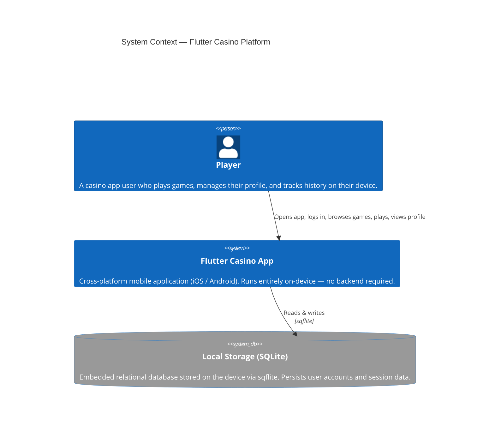

# C4 Level 1 — System Context

> Who uses the system and what does it interact with?

## Notes

- **No network dependency** — the app is fully self-contained; all data lives in SQLite on the device.
- **Single actor** — only the human Player interacts with the system.
- Future iterations may add a remote backend (REST / WebSocket) for real-money flows, but that is out of scope for the current version.
