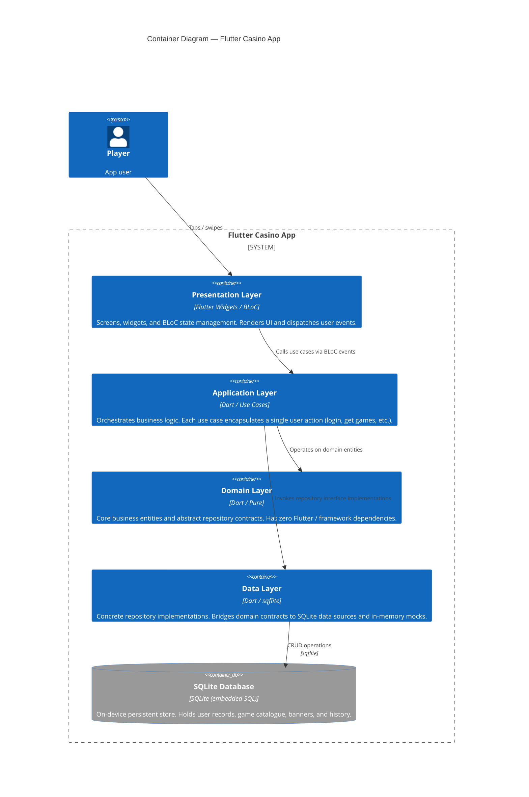

# C4 Level 2 — Container Diagram

> What are the high-level building blocks inside the Flutter Casino App?

## Layer responsibilities

| Layer | What lives here | Key rule |
|---|---|---|
| **Presentation** | Screens, widgets, BLoC (`*Bloc`, `*State`, `*Event`) | No business logic; only UI state |
| **Application** | Use cases (`*UseCase`) | One public `execute()` / `call()` method each |
| **Domain** | Entities, repository interfaces, value objects | Pure Dart — no external packages |
| **Data** | Repository impls, SQLite models (`@Collection`), mock sources | Implements domain interfaces |
| **SQLite DB** | On-device `.isar` file | Managed entirely by SQLite runtime |
