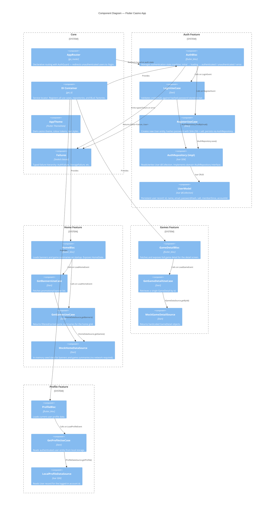

# C4 Level 3 — Component Diagram

> Internal components of the Flutter Casino App, organised by feature.

## Component summary

| Feature | BLoC | Use Cases | Repository / Source |
|---|---|---|---|
| **Auth** | `AuthBloc` | `LoginUseCase`, `RegisterUseCase` | `AuthRepository` → Isar `UserModel` |
| **Home** | `HomeBloc` | `GetBannersUseCase`, `GetGamesUseCase` | `MockHomeDataSource` |
| **Games** | `GameDetailBloc` | `GetGameDetailUseCase` | `MockGameDetailSource` |
| **Profile** | `ProfileBloc` | `GetProfileUseCase` | `LocalProfileDataSource` → Isar |
| **Core** | — | — | `AppRouter`, DI (`get_it`), `AppTheme`, `Failures` |
