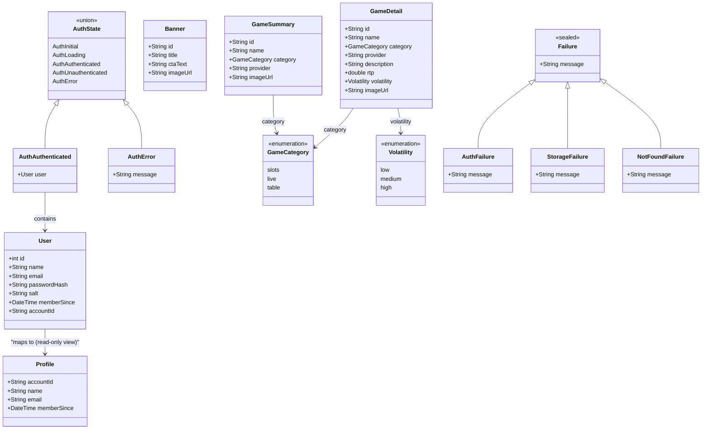

# C4 Level 4 — Key Domain Models

> Core entities, enums, and state types that drive the application.



## Domain model notes

| Model | Layer | Storage | Notes |
|---|---|---|---|
| `User` | Domain / Data | Isar `@Collection` | Password never stored in plain text — only SHA-256 hash + random salt |
| `GameDetail` | Domain | In-memory mock | Full detail shown on game detail screen |
| `GameSummary` | Domain | In-memory mock | Lightweight card shown in home grid |
| `Banner` | Domain | In-memory mock | Promotional banners on home screen |
| `Profile` | Domain | Derived from `User` | Read-only view model for profile screen |
| `AuthState` | Presentation | BLoC state | Sealed union; `AuthAuthenticated` carries the `User` |
| `Failure` | Domain | — | Sealed hierarchy; used in `Either<Failure, T>` return types |

### Password hashing flow

```
plainPassword + randomSalt
        │
        ▼
  SHA-256 (crypto package)
        │
        ▼
  passwordHash  ──► stored in Isar User record
```
